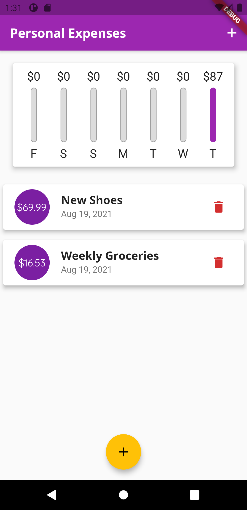
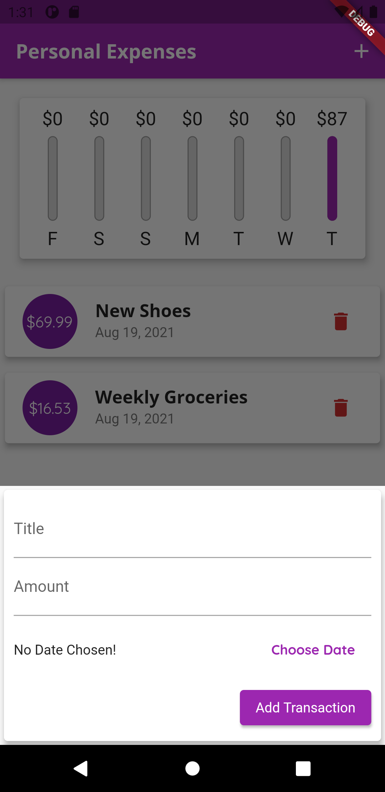
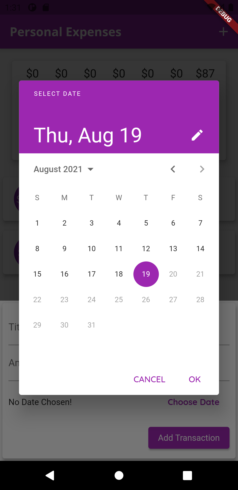
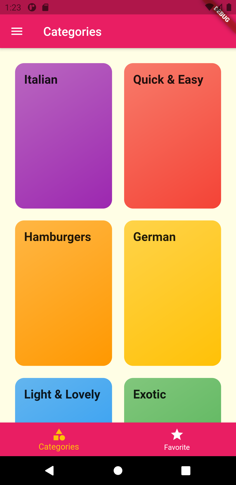
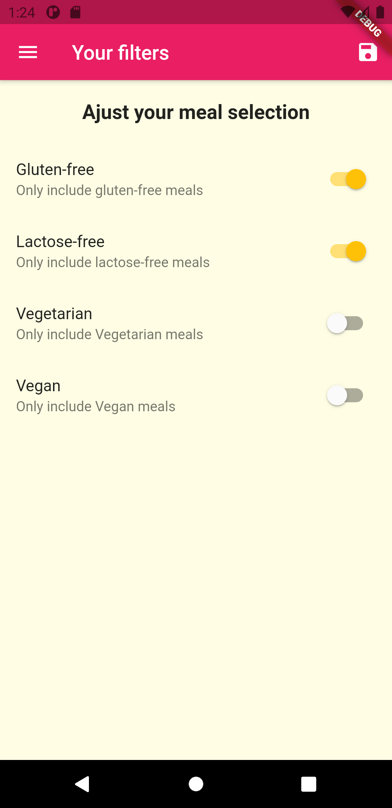
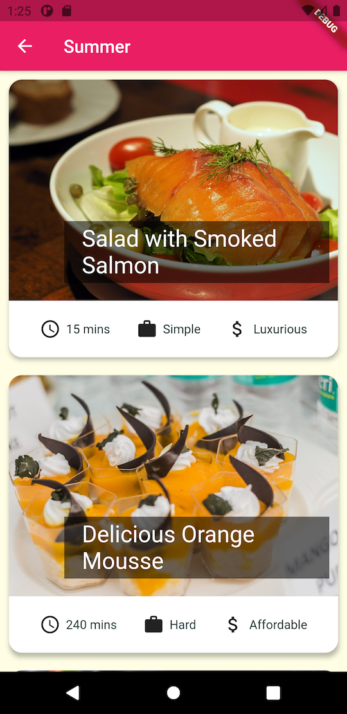
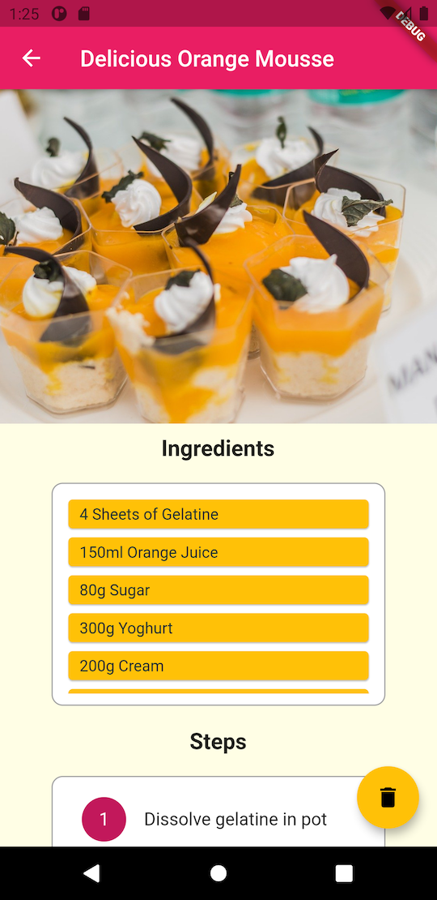

# Flutter tutorial

## **Personal expenses app**

    

        
    

    

        
    

    

        
    

    

## **Meal app**

    

        
    

    

        
    

    

        
    

    

        
    

    

        
    

    

